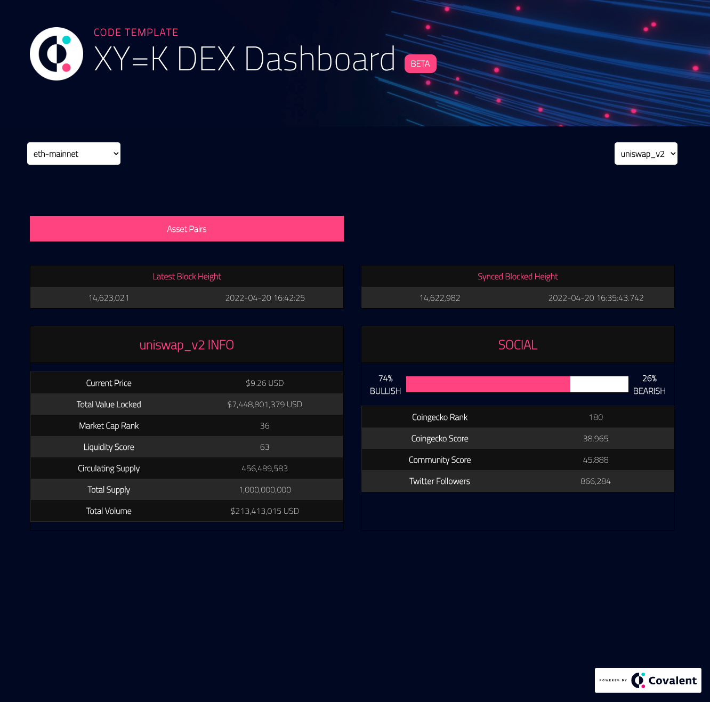

# DEX-SENSE DASHBOARD
This is a project submitted for the hackfs hackathon which utilizes the Covalent API to display DEX metrics across multiple chains supported by covalent. 

## Live Demo
GitHub pages - https://dex-dashboard-pi.vercel.app/

The live demo displays:
* Both blockchain and DEX selectors
* A DEX token summary
* A DEX market sentiment and socials summary
* Details of the asset pairs traded on the DEX
